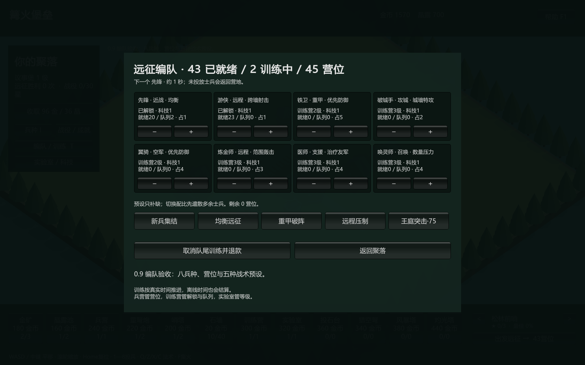
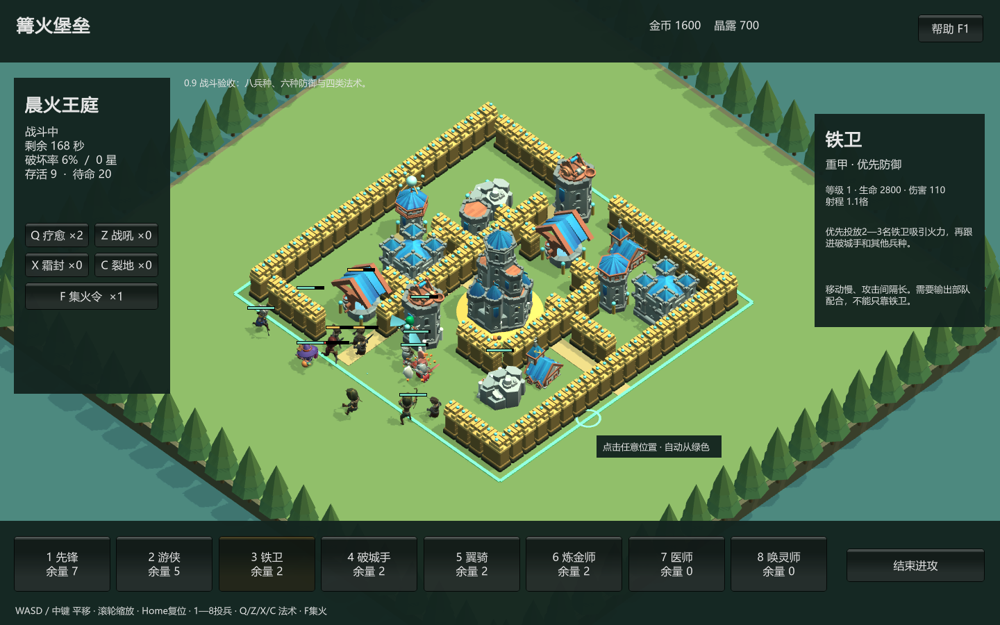
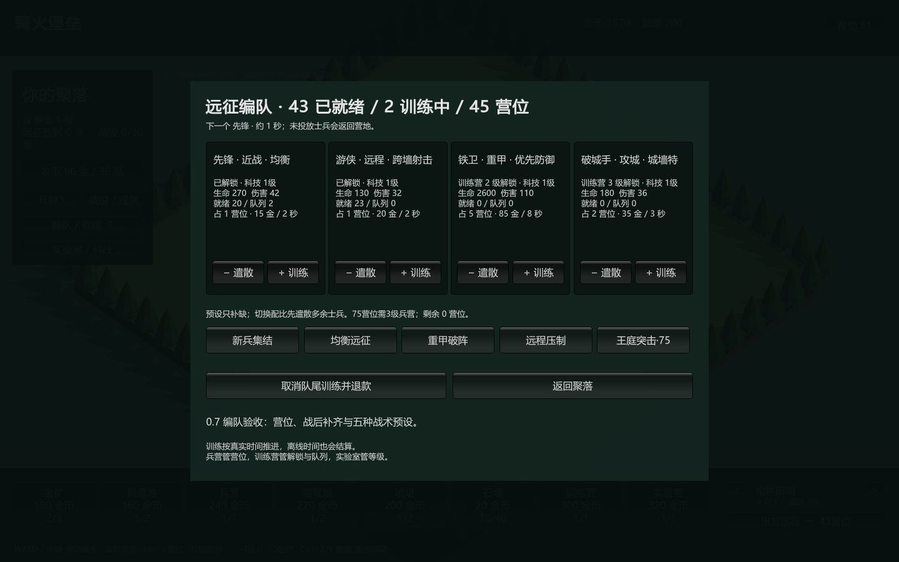
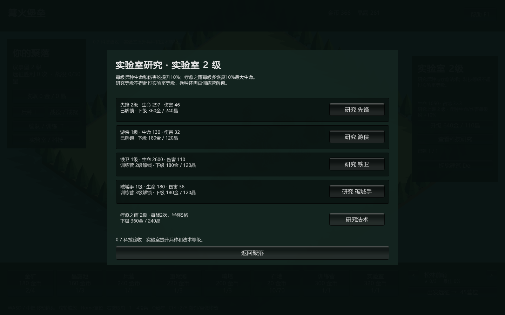
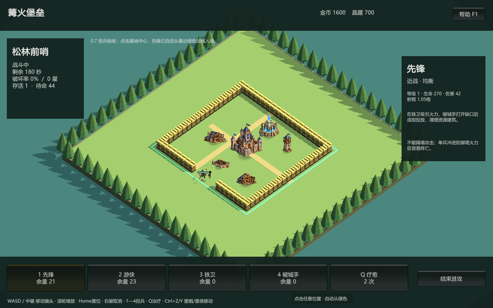
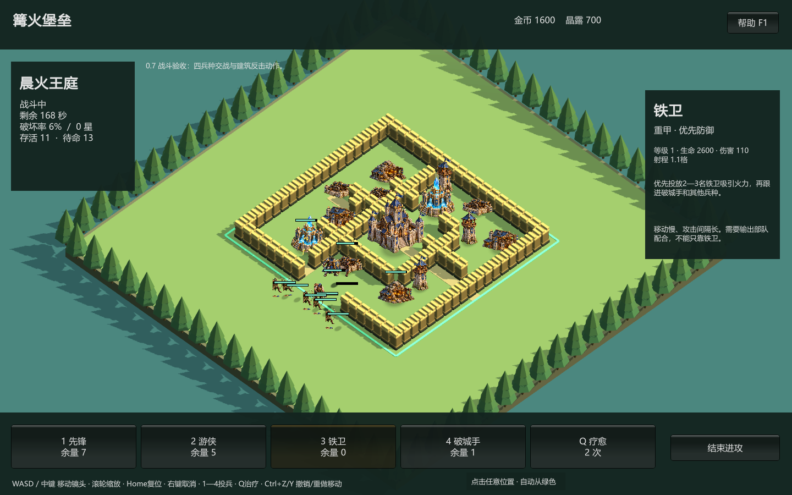

# 篝火堡垒 · Hearthhold

Windows PC 原型，Unity 版本 0.9.0-preview。原创的建造与异步攻城方向项目。

当前交付包括一个轻量的 Windows 原生试玩程序，以及共享相同 C# 规则与战斗逻辑的 Unity 3D Windows 试玩版。原生程序用 WinForms/GDI+ 绘制等距画面；Unity 客户端优先加载 CC0 三维建筑和骨骼角色，资源缺失时回退到程序化网格。五种兵使用独立 Quaternius 动画角色，铁卫、翼骑、炼金师使用 KayKit 模型加专用骨骼动作。第三方资产来源与许可证见 `THIRD_PARTY_ASSETS.md`。

## 本地构建与试玩

Git 仓库只保存源码、配置、测试和必要文档，不提交可执行文件、发布压缩包、Unity 安装器、测试数据或用户存档。克隆后在项目目录执行：

```powershell
powershell -NoProfile -ExecutionPolicy Bypass -File .\tools\build-preview.ps1 -Test -Package
```

随后双击 `artifacts/WindowsPreview/Hearthhold.exe`，或解压 `artifacts/Hearthhold-0.9.0-native-win-x64.zip`。运行环境为 Windows x64 和 .NET Framework 4.x；本机已完成编译和交互验证，无需 Unity 或 .NET SDK。

Unity 3D 版使用 Unity `6000.6.0f1` 构建：

```powershell
powershell -NoProfile -ExecutionPolicy Bypass -File .\tools\build-unity.ps1 -Action Build -Package
```

构建后运行 `artifacts/WindowsUnity/Hearthhold.exe`，发布包为 `artifacts/Hearthhold-0.9.0-unity-win-x64.zip`。首次构建需要已安装、登录并激活的 Unity 编辑器；发布包运行时不需要安装 Unity。

第一次进入时，已有一座主城、两座金矿、一座晶露池、一座兵营、一座训练营、一座实验室、两座防御建筑和一段城墙。兵营提供容量，训练营决定可训练兵种，实验室升级兵种与疗愈法术。可以先收取产出、摆放建筑，再点右下角“出发远征”。





## 本轮更新

- 视觉迭代：先锋、游侠、破城手、医师和唤灵师使用五套不同的 Quaternius 三维骨骼角色及原生动作；游侠的拉弓、放箭分段播放并压缩到实际攻击间隔内。铁卫新增举盾挥击，翼骑新增双翼拍动和悬浮起伏，炼金师新增投掷起手；铁卫盾牌和翼骑翅膀改为有厚度/羽片轮廓的三维网格。
- 旧版风暴塔满血 760 调整到新版 900 后，已有存档会只针对该历史数值自动迁移；建筑、资源、部队和战役进度保持不变，异常生命值仍被拒绝。真实旧存档已通过只读加载及 Unity 画面验收。
- 0.9.0 时 Unity 建筑替换为 KayKit `Medieval Hexagon Pack` 的13个明亮卡通 CC0 FBX，兵种起初采用同作者 `Adventurers Character Pack`；后续逐步引入上述五套 Quaternius 角色。运行时按占地自动归一尺寸、贴地，并保留程序化模型作为资源缺失兜底。完整来源见 `THIRD_PARTY_ASSETS.md`。
- 0.9.0 将兵种从4种扩展为8种：新增不受城墙阻挡且优先防御的翼骑、范围攻击的炼金师、寻找受伤友军的医师、周期召唤临时幽影的唤灵师；训练、营位、研究、预设、图鉴和战斗栏全部读取同一套规则数据。
- 防御语法扩展为6类：重弩炮改为地面单体，哨塔保持地空通用单体，并新增带近距盲区的投石台、只打空军的猎空弩、近程范围风暴塔、持续锁定后伤害递增的灼光塔。
- 战斗新增战吼、霜封和裂地，与疗愈组成4种法术：分别强化范围友军、暂停范围防御、直接打开一片城墙；Unity 与原生版都有独立的范围颜色、粒子和状态反馈。快捷键为 Q / Z / X / C，集火令改为 F。
- 战役后半段开始混入新防御；确定性平衡模拟要求基础兵海无法从第9、10关得星，而75营位、满科技且正确使用破墙/强化/冻结的专业配比能够继续推进。
- 0.8.0 Unity 建筑和兵种改为真实三维网格；R / Shift+R 可按45度步进旋转镜头，模型会呈现不同侧面，攻击与受击动作作用于网格本体。日照阴影变短、变浅，默认镜头拉近。
- 战斗新增每场2次的集火令：开战后按 E 或点击左侧按钮，再点击存活的敌方非城墙建筑，所有在场部队集中进攻7秒；不能直接造成伤害或跳过城墙。Unity 和原生预览版共享同一确定性规则。
- 重弩炮命中时会伤及目标附近1.3格内的其他士兵，哨塔仍为单体攻击；重甲吸引火力、分批/分侧投放与集火时机因此更重要。
- 0.7.0 拆分三座功能建筑：兵营按等级提供45/60/75营位；训练营1级开放先锋与游侠、2级开放铁卫、3级开放破城手，并承载训练队列；实验室研究四种兵和疗愈之雨，研究等级不超过实验室等级。
- 战斗使用出征时的科技快照：兵种每级生命和伤害约+10%，疗愈法术每级增加约10%最大生命的恢复量。训练面板、兵种图鉴、战斗兵卡与选中建筑卡展示实际数值和解锁条件。
- 新增45营位基础编队与75营位王庭编队；中后期守军生命和反击强度上调。确定性模拟中基础兵团可赢第一关，但在第9、10关拿不到星；满科技75营位队伍可获得三星，第10关优于同营位基础兵海。
- 训练营和实验室使用两张按现有色板与等距镜头生成的独立原创建筑立绘；旧版存档保留部队与队列，迁移时自动补建3级训练营及1级实验室。
- 0.6.3 按六张建筑原图各自的实际底部留白裁切，并将立绘接地点移向镜头一侧，与地面占地和接触阴影对齐；建造预览也使用同一地面高度。
- 0.6.2 修复战后预设无法补兵：三套预设现在按“就绪 + 排队”人数补齐缺员，保留当前士兵；训练弹窗直接显示营位或金币不足等原因。
- 修复战斗中定时保存可能把暂时转入战场的兵力写成零的问题；异常重启时保存出征前阵容，正常结算仍消耗已投放单位。若整队打光且队列为空、金币不足 80，结算时补足到 80 金币供重新训练。
- Unity 建筑移除过大的模型投影，改用贴地柔和接触阴影并裁掉画面底部留白；兵种攻击和防御建筑反击增加出手、位移、倾斜和后坐动作。
- 0.6.1 修复 Unity 战斗帧被错误提前返回的问题；此前会导致进入进攻后鼠标输入、战斗推进和兵种渲染全部停止。
- 进攻时可点击战场任意地块，单位自动吸附到离点击位置最近的合法绿色战线；高亮圆环预览实际落点，按住左键仍可连续部署。
- 主堡、金矿、晶露池、远征营、重弩炮、哨塔和四类兵种已真正接入原创生成式运行素材。建筑使用六张独立画面，避免旧图集裁切串入相邻旗帜和火把；程序化网格保留碰撞，连续城墙继续使用浅石程序化模型。
- 新增专用 Unity 投兵验收：必须同时确认中心点击产生合法单位，以及 Unity 已创建带生成式美术材质的活动渲染对象；与聚落、战役、训练、交战合计五类成品烟雾测试。
- 0.6 新增战前编队与45点初始营位。每名兵种有独立占用：先锋1、游侠1、铁卫5、破城手2；升级或增加远征营会扩充容量。
- 新增原创训练队列：训练逐个完成并消耗金币，支持取消最后一个项目并全额返还；退出游戏后按真实离线时间推进，战斗中不显示训练完成，返乡后补算。
- 提供“均衡远征、重甲破阵、远程压制”三套同容量预设，也可逐个解散、训练自定义组合。出征只带当前成军阵容，已部署单位消耗，未部署预备队结算时返回。
- 建筑和兵种进一步增加层次、轮廓与职业装备，统一为深青屋顶、暖色石材、木材和黄铜；主城镜头更近，顶面补光、边缘光和阴影层次重新调整。
- 重做远程箭矢、重弩炮火弹、哨塔反击、近战命中、治疗法术和建筑摧毁效果；弹道与命中形状按攻击来源区分，压低全屏霓虹感。
- 使用原创 3D 美术方向板约束比例、材质和特效语言，并据此生成分离的运行素材，详见 [`docs/VISUAL-DIRECTION.md`](docs/VISUAL-DIRECTION.md)；没有使用外部游戏资产。
- 0.5 新增 10 关原创 PvE 战役：从松林前哨到晨火王庭，包含开放缺口、完整外墙、十字隔墙、双环和分区迷阵等布局；至少获得1星才能解锁下一关。
- 每关持久化最高星级与最佳破坏率，聚落显示总星数；旧版存档读取时自动补齐战役进度，不修改原有建筑和资源。
- 新增 5 个成就及手动领取奖励，覆盖建造、议事堡升级、首次胜利、累计星数和攻克关卡数；仓库不足时不会吞掉奖励。
- Unity 与轻量 Windows 客户端都加入战役/成就面板、锁定提示和关卡纪录；成品自动验收扩展为聚落、战役地图和最终关卡三种场景。
- 0.4 强化 Unity 表现层：建筑选中圆环、带模型的建造/移动预览、投兵边界和平滑兵种移动；0.6.1 将边界改成绿色并加入最近落点预览。
- 远征加入三维远程弹道、近战冲击圈、治疗范围圈、受击闪光与建筑摧毁碎片；血条会按健康、受伤、濒危变色。
- 战斗信息显示存活与待命人数，地图投兵提示增加高对比底板；新增首页和交战阶段两套成品烟雾测试。
- Unity 工程已升级并锁定为 Unity 6000.6.0f1 / URP 17.6.0，生成完整项目设置、资源 `.meta`、主场景和包锁文件；Windows x64 构建已实际成功。
- 重做 7 类建筑、1—3 级外观和 4 类兵种：加入屋瓦、拱门、砖石接缝、金矿道具、晶簇、武器与护甲，建筑卡片和兵种图鉴使用对应模型。
- 选中建筑后按 Delete 或点击“拆除建筑”，确认后拆除并返还建设、历次升级投入的 50%。议事堡不可拆；返还受仓储上限限制；拆除不可撤销。
- 建造卡片显示“已建 / 上限”。上限随议事堡升级增加，拆除释放名额，移动不消耗名额。
- 按 I 打开兵种图鉴；战斗右侧显示当前兵种的职责、数值、战术和弱点；本次运行第一次出征自动显示投兵教学。

| 建筑 | 议事堡 1 级 | 2 级 | 3 级 |
|---|---:|---:|---:|
| 议事堡 | 1 | 1 | 1 |
| 金矿 | 3 | 4 | 5 |
| 晶露池 | 2 | 3 | 4 |
| 兵营 | 1 | 1 | 1 |
| 训练营 | 1 | 1 | 1 |
| 实验室 | 1 | 1 | 1 |
| 重弩炮 | 2 | 3 | 4 |
| 哨塔 | 2 | 3 | 4 |
| 投石台 | 0 | 1 | 1 |
| 猎空弩 | 0 | 1 | 1 |
| 风暴塔 | 0 | 1 | 1 |
| 灼光塔 | 0 | 1 | 1 |
| 石墙 | 40 | 70 | 100 |

拆除前会先收取已经产生的收益；拆除最后一座兵营后，需要重建才能出征。拆除训练营会暂停队列并阻止新兵训练，重建后恢复。确认拆除也会清空移动撤销记录，避免复活已拆除建筑。

## 已实现

- 40×40 逻辑地图；边界、建筑占地、资源消耗检查。
- 议事堡、经济/军事建筑、城墙，以及6类不同目标层和射程语法的防御，共 13 类建筑。
- 单个建筑选择、移动、升级、确认拆除；分类型建造数量上限；移动撤销/重做；按住连续铺墙。
- 两种资源、仓储上限、离线产出（最多 8 小时）、收取。
- 主城和其他建筑 1—3 级；其他建筑等级受主城限制；本原型升级即时完成。
- 先锋、游侠、铁卫、破城手、翼骑、炼金师、医师、唤灵师 8 类兵种；兵营容量、五套预设、训练营解锁/队列和实验室科技。
- 十关敌方基地；侦察阶段不计时；首名士兵部署后开始 180 秒战斗。
- 地空双层移动、可破坏城墙、目标偏好、远程与范围攻击、治疗、召唤、6类防御反击，以及疗愈/战吼/霜封/裂地4种法术。
- 破坏率、星级、结算和返回基地；奖励在单次战斗对象内只结算一次。
- 自动存档、原子替换、备份恢复；读档失败时保留原文件并明确报错。
- 可调窗口、F11 无边框全屏、镜头移动/缩放、快捷键帮助。

## 操作

| 操作 | 键位 |
|---|---|
| 移动镜头 | WASD / 鼠标中键拖动 |
| 缩放 / 复位 | 滚轮 / Home |
| 选择建筑 | 左键点建筑 |
| 建造 | 点底部建筑卡，再点地面 |
| 连续铺墙 | 选石墙，按住左键拖动 |
| 移动 / 升级所选建筑 | M / U |
| 拆除所选建筑（需确认） | Delete |
| 撤销 / 重做移动 | Ctrl+Z / Ctrl+Y |
| 收取资源 / 手动保存 | C / Ctrl+S |
| 选择兵种 / 连续投兵 | 1—8 / 在战场任意地块点击或按住左键，自动吸附绿色战线 |
| 兵种图鉴与战术介绍 | I |
| 战前编队与训练 | T |
| 选择范围治疗 | Q，再点击友军附近 |
| 战吼 / 霜封 / 裂地 | Z / X / C，再点击有效范围 |
| 集火目标 | F，再点击存活的非城墙建筑 |
| 取消当前操作 | 右键 / Esc |
| 网格 / 帮助 / 全屏 | G / F1 / F11 |

帮助、兵种图鉴和教学面板打开时，本地战斗暂停。训练按现实时间推进，但进入战斗后暂停；初期推荐先锋吸引火力、游侠后排输出；训练营升级后可用铁卫扛伤、破城手开墙。部队受伤后按 Q 治疗。音效开关目前仅控制建造提示音，没有完整的战斗配音或音乐。

## 存档

Windows 试玩：`Hearthhold.exe` 同级的 `Saves/village.xml`，上一份存档为 `village.xml.bak`。

Unity：`Application.persistentDataPath/village.xml`。两个客户端默认使用独立存档位置。

每 15 秒以及建造、升级、拆除、收取、结算、正常退出时保存。未结算战斗不会覆盖最后一份聚落存档；战斗中正常退出会放弃本场、不给奖励并返还完整出征阵容。战斗回放/断点续战没有实现。

0.7.0 兼容旧版第1版存档。更新前退出游戏并备份 `Saves` 文件夹；在原目录替换程序即可继续原村庄，换目录则手动复制 `Saves`。旧存档首次读取时保留原有建筑、资源、部队和队列，自动寻找空地补建3级训练营和1级实验室；若村庄已密集到无法放置新建筑，加载会报错并保留原文件，不会静默覆盖。新游戏从基础兵种开始。本次开发测试没有修改用户正式存档。

不要在同一个目录同时启动多个试玩实例；当前存档没有跨进程写入锁。如果主存档与备份都损坏，程序报错退出，不会自动创建新村覆盖它们。

## 本机构建与测试

在项目目录执行：

```powershell
powershell -NoProfile -ExecutionPolicy Bypass -File .\tools\build-preview.ps1 -Test -Package
```

使用 Windows 自带 .NET Framework C# 编译器，编译共享核心和原生预览器，不下载依赖。`-Test` 执行核心测试及鼠标/键盘交互测试，并在 `artifacts/screenshots` 输出画面。`-Package` 生成仅含程序和说明的试玩压缩包，不打包用户存档或测试数据。

## Unity 工程

路径：`UnityProject`。工程基线已更新为本机实际安装的 Unity `6000.6.0f1` / URP `17.6.0`。

1. 在 Unity Hub 中添加 `UnityProject`，使用 Unity 6.6 编辑器打开。若要升级版本，先提交当前工程并验证包兼容性。
2. 首次打开会从 Unity Package Manager 获取 URP，并编译脚本。
3. 编辑器脚本自动创建 URP 配置、基础材质和 `Assets/Hearthhold/Scenes/Main.unity`。
4. 选择菜单 `Hearthhold > Open main scene`，点击 Play。场景和游戏对象在运行时生成，编辑模式的初始场景为空是预期行为。
5. 选择 `Hearthhold > Build Windows x64`，构建到 `artifacts/WindowsUnity`。

**当前机器已使用 Unity 6000.6.0f1 / URP 17.6.0 实际完成 Windows x64 构建。** 构建日志包含 `Build Finished, Result: Success` 和本轮输出路径标记；六项运行时烟雾测试以独立测试存档启动程序，分别渲染 1440×900 聚落、战役进度、训练编队、实验室研究、交战和单兵部署画面并以退出码 0 结束。

Unity 客户端已接入原创生成式建筑/兵种素材、贴地接触阴影、出手/后坐动作、拆除确认、建造上限、兵种图鉴、训练编队、实验室研究和首次出征引导。自动构建、六类验收画面与规则层确定性平衡模拟已经验证；10关逐关人工试玩和持续性能测试仍待完成，不能把烟雾测试视为全部玩法验收。









2026-09-06 环境推进：默认官方下载入口实际返回 Hub 3.3.6，安装后其列表只包含 2020—2022 系列编辑器；随后使用官方指定版本入口取得 Hub 3.21.0，并成功升级到 `C:\Program Files\Unity Hub\Unity Hub.exe`。新安装器为 `artifacts/Installers/UnityHubSetup-3.21.0-x64.exe`，数字签名验证通过，签名主体为 Unity Technologies SF。安装器不包含在 0.2 试玩压缩包中。

Unity Hub 的命令行曾遇到用户配置原子重命名错误，但用户通过 Hub 完成编辑器安装和许可证准备后，编辑器批处理构建与运行不受该问题影响。

已添加 `tools/build-unity.ps1`：

```powershell
# 仅读取安装状态，不启动 Unity、不读取账号凭据
powershell -NoProfile -ExecutionPolicy Bypass -File .\tools\build-unity.ps1 -Action Check
# 编辑器安装并激活后，准备工程或构建 Windows 版
powershell -NoProfile -ExecutionPolicy Bypass -File .\tools\build-unity.ps1 -Action Prepare
powershell -NoProfile -ExecutionPolicy Bypass -File .\tools\build-unity.ps1 -Action Build
powershell -NoProfile -ExecutionPolicy Bypass -File .\tools\test-unity-player.ps1 -Case All
```

自定义安装位置可增加 `-EditorPath "E:\你的安装位置\Editor\Unity.exe"`。脚本校验工程要求与编辑器版本，不自动升级/降级；日志分别保存在 `artifacts/UnityLogs`，构建后检查完整产物与本轮日志成功标记，避免把旧文件当成新构建成功。`-Package` 会排除 Unity 明确标记为不可发布的备份目录，再生成 Windows 发布包。

Unity 客户端使用旧版 `Input` API。如果打开工程后出现输入后端异常，在 Player Settings 的 Active Input Handling 中选择 Input Manager (Old) 或 Both。编辑器首次准备脚本会在可访问相应设置时配置它。

## 目录

```text
Hearthhold/
  UnityProject/
    Assets/Hearthhold/
      Core/        纯 C# 数据、经济、战斗、寻路、存档、共享模型几何
      Runtime/     Unity 3D 表现与输入接入
      Editor/      首次工程准备与 Windows 构建
    Packages/      URP 与模块依赖
    ProjectSettings/
  NativePreview/   当前可运行的 Windows 等距预览器
  Tests/           核心行为与交互验证
  tools/           构建、测试、打包脚本
  release/         试玩说明
  docs/            开发状态和后续工作
  artifacts/       本机构建产物（不提交版本控制）
```

## 范围说明

这一版是 0.9.0 可玩原型迭代，不是完整商业游戏。Unity 建筑与兵种现在使用可旋转的程序化三维网格，但还没有专业角色骨骼、复杂建筑材质和完整动画系统。尚未实现：联网账号、匹配、服务端校验、部落系统、建筑升级计时队列、英雄、攻城器械、框选多建筑、完整音效、保存的战斗回放与设置持久化。

本地存档可修改、本地时钟可调整，均不能作为在线经济的信任来源。在线版需建立独立权威进度、战斗凭据和数据库事务结算。固定整数步长的回归测试证明同一运行环境下结果可复现，跨 Unity/服务端运行时的一致性仍须验证。

地图、程序化网格、生成式画面和名称均为本项目原创，没有使用《部落冲突》或参考私服的素材、协议与数据。外部项目的用途边界和本轮独立实现清单见 [`docs/REFERENCES.md`](docs/REFERENCES.md)。

家乡玩法、兵种、建筑、英雄、战宠、装备、法术、攻城器械和当前等级上限的研究基线见 [`docs/COC_HOME_VILLAGE_BENCHMARK_2026.md`](docs/COC_HOME_VILLAGE_BENCHMARK_2026.md)。该文档用于提炼系统规律和规划原创实现，不作为可直接复制的美术、文案或数值资产。
